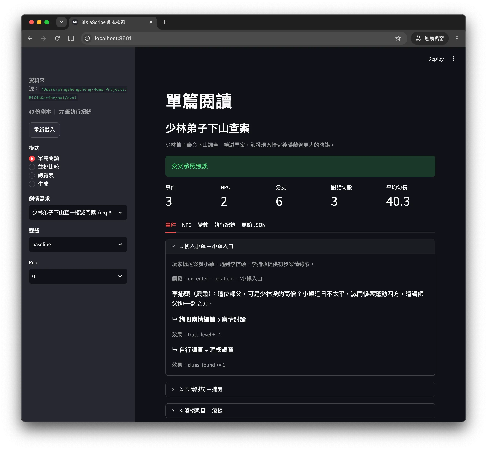
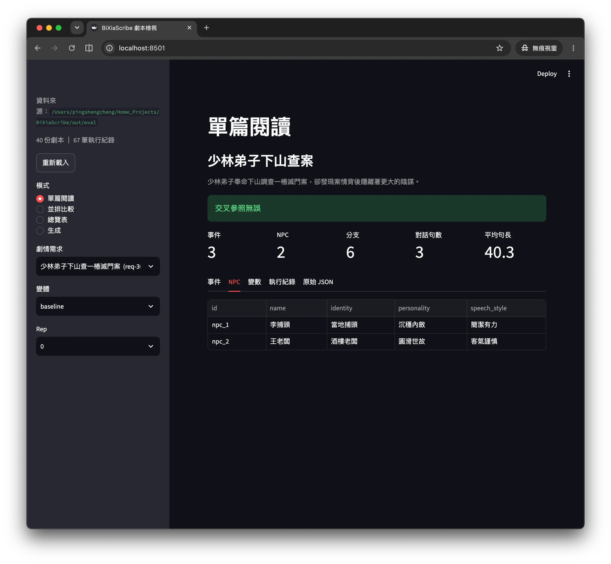
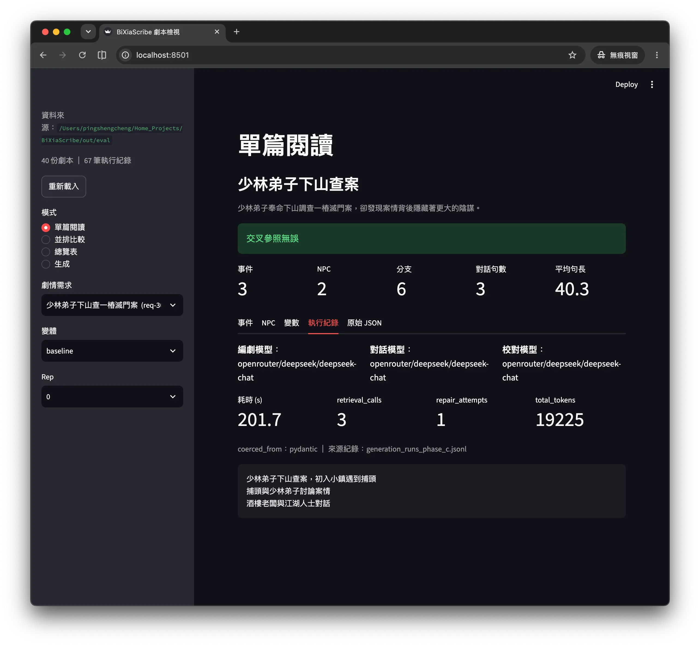

<div align="center">

# BiXiaScribe

**用 RAG 檢索武俠語料，交給多 agent 生成結構化的武俠 RPG 劇本 JSON。**

[](./LICENSE)
[](https://www.python.org/)
[](https://github.com/passpier/BiXiaScribe/stargazers)

[繁體中文](./README.md) | [English](./README.en.md)

</div>

---

## 這是什麼？

BiXiaScribe 是一個武俠 RPG 劇本生成器。輸入一句劇情需求（例如「少林弟子下山查一樁滅門案」），
它會從你自建的武俠小說語料庫檢索相關內容，再交給三個分工的 LLM agent（編劇 → 對話 → 校對）
產出一份結構化的劇本 JSON——含 NPC 設定、事件、分支選項、觸發條件——可作為後續遊戲製作
（如 RPG Maker）的素材來源。

## 介面預覽

用瀏覽器讀、比較 `scripts/eval_generation.py` 已生成的劇本，取代肉眼開 `out/eval/*.json` 的手動流程。
共四種模式——**單篇閱讀 / 並排比較 / 總覽表 / 生成**；「生成」模式則會在背景執行緒觸發一次真正的生成，
即時顯示經過秒數、以任務為單位的進度條，還有一個真的能中斷執行的「取消」鍵。


*事件分頁：把觸發條件、對話台詞、分支選項渲染成可讀的散文，而不是原始 JSON。*

<table>
<tr>
<td width="50%">

<em>NPC 分頁：角色表（id / 姓名 / 身分 / 性格 / 說話風格）。</em>
</td>
<td width="50%">

<em>執行紀錄分頁：這次生成的 <code>RunReport</code>——三個 role 各自用的模型、耗時、
<code>retrieval_calls</code>、<code>repair_attempts</code>、<code>total_tokens</code>、
<code>coerced_from</code>。</em>
</td>
</tr>
</table>

`retrieval_calls` 逐份劇本攤在 UI 上，讓下方關鍵數據提到的「零檢索呼叫」現象一眼就能查，
不必再翻 log。

## 功能

- RAG 索引：中文感知切塊 → embedding → Chroma，支援斷點續傳。
- Hybrid 檢索（向量 + 自寫 BM25，見下方關鍵數據）。
- 三 agent 劇本生成（編劇 → 對話 → 校對），輸出結構化 JSON + 交叉參照驗證。
- 分層/狀態化生成管線（拆書 → 排場 → 逐場寫戲，因果圖即時校驗、斷點續跑、批次確認），
  與三 agent 管線並存，設 `PIPELINE_MODE=layered` 或用 CLI/UI 的對應旗標選用。
- 模型組合 A/B 與成本估算（`scripts/eval_generation.py`），單元測試全程不打真實 API。
- 可關閉語料檢索（`RETRIEVAL_ENABLED=false` / `--no-retrieval` / UI 勾選框），省下最大宗的 token
  花費，用來 A/B 語感本身較好的模型是否真的需要語料佐證。
- Streamlit 介面，四種模式，含瀏覽器直接觸發生成——見上方[介面預覽](#介面預覽)。
- 📋 規劃中：從 UI 編輯/存回劇本、RPG Maker 匯出。

## 為何用這套架構生成武俠劇本

跟直接丟一句 prompt 給 ChatGPT 生劇本比起來，BiXiaScribe 的差異：

- **RAG 檢索真實語料，而非純靠模型腦補武俠語感** —— 索引自建語料庫，生成對話時用檢索結果
  餵給 LLM，用詞、招式名稱更貼近原著風格。
- **中文感知的切塊器** —— 以字元數計長度、優先在段落/句讀處切分，不是照搬英文 NLP 工具的
  token 切法。
- **結構化輸出 + 自動交叉驗證** —— 劇本的 `dialogue.npc`、`choices[].next` 等欄位互相參照用
  Python 二次檢查，不是「LLM 自己說校對過了就算過」。
- **本機優先、零成本可跑通全流程** —— 預設 embedding 是本機 `bge-m3`（離線、免費、免 API
  key）；LLM 也有 `fake` 模式，跑測試不需要真的呼叫任何模型 API。

## 關鍵數據

- 檢索：嚴格比較（`--top-k 1`）下，關鍵字命中率 hybrid 91.7% vs 純向量 75%——字元 bigram
  BM25 補上了向量檢索容易漏掉的武俠專有名詞比對。
- 生成 no-RAG A/B（2026-08-19）：有檢索那組 `usd_per_event` $0.0043，比無檢索的 $0.0081
  還低（同時 NPC 開口率、對話行長都更高），且死分支比例（self-loop）從 20% 降到 0%。
- 一個仍然成立的非顯而易見發現：`retrieval_calls` 顯示「模型宣稱支援 function calling」不等於
  「在 CrewAI 的 ReAct loop 裡真的會主動呼叫工具」，需要逐模型檢查。

完整表格、方法論與歷次 A/B 見 [`docs/BENCHMARKS.md`](./docs/BENCHMARKS.md)。

## 快速開始

```bash
python3.12 -m venv .venv && source .venv/bin/activate
pip install -r requirements.txt
cp .env.example .env   # 只有要跑劇本生成（OpenRouter）才需要
```

```bash
# 1. 建索引（範例語料，10 秒內跑完，免 API key）
python scripts/build_index.py --corpus tests/sample_corpus.txt

# 2. 查詢檢索結果（預設 hybrid 模式：向量 + BM25）
python scripts/test_retrieval.py --query "獨孤九劍的劍法精要" --top-k 3

# 3. 生成劇本前先零成本檢查 backend/API key/索引是否就緒
python scripts/generate_script.py --requirement "測試" --preflight-only

# 4. 生成劇本（需要 LLM_BACKEND=openrouter + OPENROUTER_API_KEY）
python scripts/generate_script.py --requirement "少林弟子下山查一樁滅門案" --out script.json

# 4b. 同上，但用可斷點續跑的分層管線（見 CLAUDE.md）
python scripts/generate_script.py --requirement "..." --pipeline-mode layered

# 5. 用瀏覽器檢視/並排比較已生成的劇本（免 API key、免 token），或用「生成」模式直接觸發生成
pip install -r requirements-ui.txt
.venv/bin/streamlit run ui/app.py
```

（畫面見上方[介面預覽](#介面預覽)）

自己的語料放進 `data/corpus/`（不假設 UTF-8）；換語料/換 embedding backend、比較檢索與模型
組合品質的完整指令，見 [`docs/DESIGN_NOTES.md`](./docs/DESIGN_NOTES.md)。

## 輸出格式

`script.json` 結構大致如下（完整欄位定義見
[`src/bixiascribe/schema.py`](./src/bixiascribe/schema.py)）：

```json
{
  "meta": { "title": "...", "theme": "...", "goal": "...", "tone": "..." },
  "stat": { "id": "mood", "name": "心境值", "init": 50 },
  "player": { "name": "...", "origin": "...", "flaw": "...", "token": "..." },
  "items": [{ "id": "...", "name": "...", "from_event": "..." }],
  "npcs": [{
    "id": "...", "name": "...", "faction_id": "...", "role": "...",
    "personality": "...", "speech_style": "..."
  }],
  "factions": [{ "id": "...", "name": "...", "motive": "..." }],
  "truth": { "public": "...", "revealed": ["..."], "hidden": "..." },
  "chapters": [{ "id": "...", "title": "...", "summary": "...", "loc": "...", "start_event": "..." }],
  "clues": [{ "id": "...", "name": "...", "from_event": "..." }],
  "endings": [{ "id": "...", "name": "...", "min": 0, "max": 100 }],
  "events": [
    {
      "id": "...",
      "title": "...",
      "summary": "...",
      "chapter_id": "...",
      "preconditions": ["..."],
      "dialogue": [{ "npc": "...", "line": "..." }],
      "check": { "on_pass": "...", "on_fail": "...", "fail_cost": "..." },
      "choices": [{
        "id": "...", "text": "...", "next": "...",
        "cost": "...", "effects": "...", "delta": -15, "payoff_at": "..."
      }]
    }
  ]
}
```

## 技術棧

| 分類 | 技術 |
|---|---|
| 語言 | Python 3.12 |
| 向量庫 | [Chroma](https://www.trychroma.com/)（embedded `PersistentClient`，本機資料夾） |
| Embedding | `bge-m3`（[FlagEmbedding](https://github.com/FlagOpen/FlagEmbedding)，本機、離線、免 API key） |
| 多 Agent 框架 | [CrewAI](https://www.crewai.com/) |
| LLM 路由 | [OpenRouter](https://openrouter.ai/)（透過 CrewAI 的 `LLM` + litellm `openrouter/` 前綴） |
| 資料驗證 | [pydantic](https://docs.pydantic.dev/) |

支援環境：Python ≥ 3.12（`crewai` 要求 ≥ 3.10，本 repo 統一用 3.12）。

## 授權

本專案程式碼採用 [MIT License](./LICENSE)。
